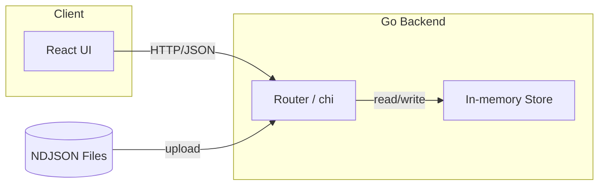
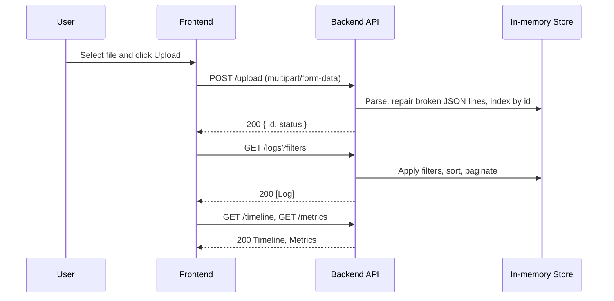

🛠️ Terraform Logs Viewer
=========================

Инструмент для загрузки, визуализации, фильтрации и экспорта Terraform логов. Проект состоит из `backend` на Go и `frontend` на Vite/React + Tailwind. Готов к запуску в Docker и локально.

- **Backend**: Go + chi, in-memory repo
- **Frontend**: Vite + React + Tailwind
- **API**: OpenAPI в `swagger.yaml`

Содержание
----------
- [Возможности](#возможности)
- [Архитектура](#архитектура)
- [Схема потоков данных](#схема-потоков-данных)
- [Быстрый старт в Docker](#быстрый-старт-в-docker)
- [Локальный запуск без Docker](#локальный-запуск-без-docker)
- [API / Swagger](#api--swagger)
- [Страницы интерфейса](#страницы-интерфейса)
- [Примеры и скриншоты](#примеры-и-скриншоты)
- [Формат логов](#формат-логов)
- [Переменные и конфигурация](#переменные-и-конфигурация)
- [FAQ](#faq)

Возможности
-----------

- 📤 **Загрузка логов** в формате NDJSON/line-delimited JSON через `/upload`
- 🔎 **Фильтрация и поиск**: по `tf_resource_type`, времени, `level`, full-text `search`
- 🧭 **Таймлайн** по `tf_req_id` (старт/конец/статус)
- 📊 **Метрики** ошибок/предупреждений
- ✅ **Пометка прочитанным** и группировка по `tf_req_id`
- ⬇️ **Экспорт** выбранных логов (скачивание JSON) и задел на Telegram

Архитектура
-----------



Схема потоков данных
---------------------



Быстрый старт в Docker
----------------------

Требования: Docker, Docker Compose.

```bash
docker compose up --build
```

- Backend: `http://localhost:8080`
- Frontend (Vite dev): `http://localhost:5173`

Локальный запуск без Docker
---------------------------

1) Backend (Go 1.22+):

```bash
cd backend
go mod download
go run ./
# сервер слушает адрес из backend/appconfig.yml (по умолчанию 0.0.0.0:8080)
```

2) Frontend (Node 20+):

```bash
cd frontend
npm install
npm run dev -- --host 0.0.0.0
# Vite dev server: http://localhost:5173
```

API / Swagger
-------------

- Файл спецификации: `swagger.yaml`
- Базовый URL: `http://localhost:8080`

Ключевые эндпоинты:

| Метод | Путь                | Описание                                 |
|-------|---------------------|------------------------------------------|
| POST  | `/upload`           | Загрузка NDJSON логов (multipart form)   |
| GET   | `/logs`             | Листинг логов с фильтрами и пагинацией   |
| GET   | `/logs/{id}`        | Получение конкретного лога по `id`       |
| POST  | `/logs/mark-read`   | Переключение флага `read` по списку `id` |
| GET   | `/groups/{tf_req_id}` | Группа логов по `tf_req_id`            |
| GET   | `/timeline`         | Таймлайн по `tf_req_id`                  |
| GET   | `/metrics`          | Агрегированные метрики                   |
| POST  | `/export/download`  | Экспорт отфильтрованных логов (JSON)     |
| POST  | `/export/telegram`  | Экспорт в Telegram (заготовка)           |
| GET   | `/corrupted-logs`   | Сырые испорченные строки логов           |

Страницы интерфейса
-------------------

- **Upload**: загрузка логов, статусы, валидация
- **Logs**: фильтры, поиск, таблица логов, отметка прочитанности
- **Detail**: подробности конкретного лога
- **Group**: логи по `tf_req_id`
- **Timeline**: визуализация событий
- **Analytics**: метрики ошибок/предупреждений
- **Dashboard**: обзор и быстрые фильтры

Примеры и скриншоты
-------------------

Вставьте сюда скриншоты UI и примеры использования:

| Экран | Скриншот |
|-------|----------|
| Загрузка | <вставить картинку> |
| Логи | <вставить картинку> |
| Детали | <вставить картинку> |
| Таймлайн | <вставить картинку> |
| Аналитика | <вставить картинку> |

Пример запроса загрузки:

```bash
curl -F "file=@Terraform\ Logs\ Example/4.tflog.json" http://localhost:8080/upload
```

Пример фильтрации логов:

```bash
curl "http://localhost:8080/logs?level=error&tf_resource_type=aws_s3_bucket&search=timeout&page=1&limit=50"
```

Формат логов
------------

- Принимается NDJSON (одна JSON-запись на строку).
- Испорченные строки пытаемся чинить с помощью `jsonrepair`; флаг `repaired=true` отображает исправленные.

Минимальный пример NDJSON:

```json
{"@timestamp":"2025-01-01T10:00:00.000000+00:00","tf_req_id":"req-1","tf_resource_type":"aws_s3_bucket","@level":"info","@message":"create"}
{"@timestamp":"2025-01-01T10:00:01.000000+00:00","tf_req_id":"req-1","diagnostic_severity":"warning","@message":"retry"}
```

Переменные и конфигурация
-------------------------

- Backend адрес: `backend/appconfig.yml` (по умолчанию `0.0.0.0:8080`)
- CORS: разрешены `http://localhost:5173`, `http://127.0.0.1:5173`
- Хранение: in-memory (данные очищаются при перезапуске)

FAQ
---

- ❓ Что с Telegram экспортом?
  - Сейчас метод возвращает `501` (unimplemented) на уровне репозитория. Можно быстро подключить бота/токен и реализовать отправку.
- ❓ Как поменять порт бэкенда?
  - Измените `addr` в `backend/appconfig.yml`, пересоберите контейнер или перезапустите `go run`.

