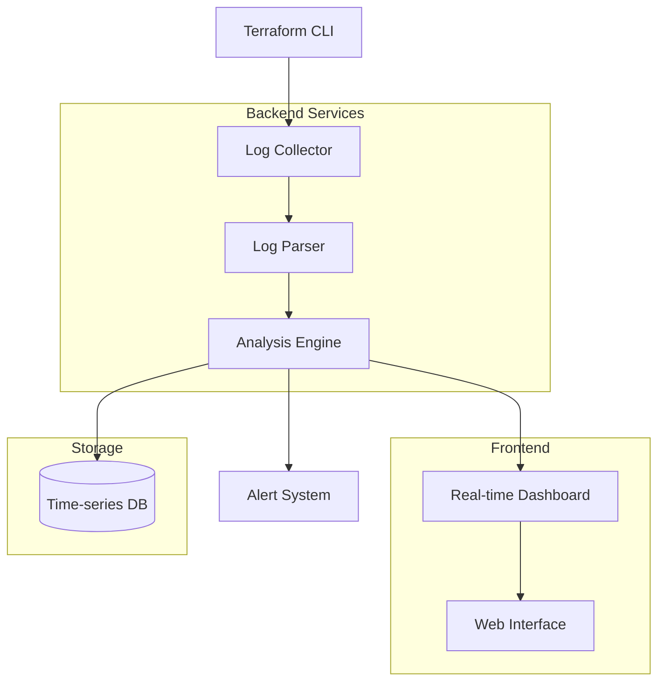

# Terraform Logs Viewer & Analyzer

**Мощный инструмент для анализа и визуализации Terraform логов в реальном времени**

[Особенности](#особенности) • [Архитектура](#архитектура) • [Установка](#установка) • [Использование](#использование)

## 🚀 Обзор

Terraform Logs Viewer - это инновационное решение для мониторинга и анализа логов Terraform операций. Система предоставляет интуитивно понятный интерфейс для отслеживания развертывания инфраструктуры, выявления проблем и оптимизации процессов.

### 🎯 Ключевые возможности

- **📊 Визуализация в реальном времени** - отслеживание прогресса Terraform операций
- **🔍 Умный анализ логов** - автоматическое определение ошибок и предупреждений
- **📈 Аналитика производительности** - метрики времени выполнения операций
- **🚨 Система оповещений** - мгновенные уведомления о критических событиях
- **💾 История выполнений** - хранение и сравнение предыдущих запусков

## 🏗️ Архитектура системы

### Схема работы

